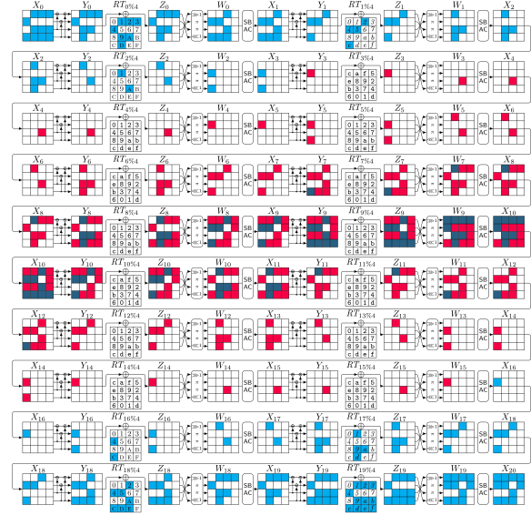
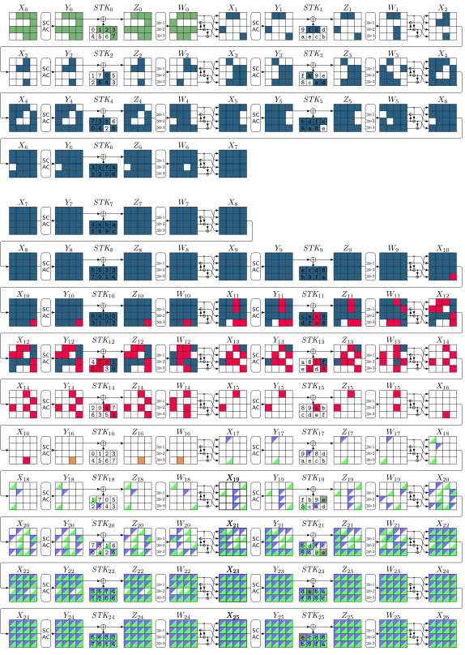
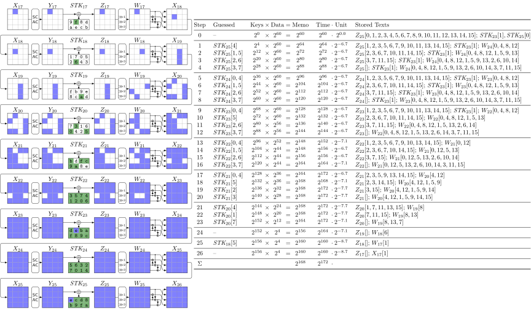
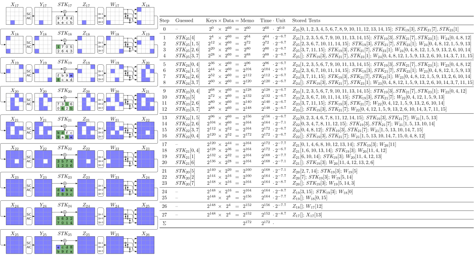

# **Finding the Impossible** [](https://opensource.org/licenses/MIT)

<!-- <div style="display: flex; justify-content: center;">
  
</div> -->


This repository contains the implementation of our method first introduced at [EUROCRYPT 2023](https://eurocrypt.iacr.org/2023/program.php) for finding the impossible-differential, zero-correlation, and integral attacks on block ciphers:

  - **Hosein Hadipour**, Sadegh Sadeghi, Maria Eichlseder: [Finding the Impossible: Automated Search for Full Impossible Differential, Zero-Correlation, and Integral Attacks](https://eprint.iacr.org/2022/1147). EUROCRYPT 2023. https://doi.org/10.1007/978-3-031-30634-1_5
---

## Tool Overview

***Zero*** is a tool for finding the full impossible differential, full zero-correlation and full integral attacks on block ciphers. In this tool we convert the problem of finding these attacks to a constraint optimization problem  (COP) as described in [our paper](https://doi.org/10.1007/978-3-031-30634-1_5). Next we use the state-of-the-art constraint programming (CP) solvers to solve it. We employ [MiniZinc](https://www.minizinc.org/) to describe the COP problem and use [Or-Tools](https://developers.google.com/optimization) and [Gurobi](https://www.gurobi.com/) as the CP solvers.

---
## Table of Contents

- [**Finding the Impossible** ](#finding-the-impossible-)
  - [Tool Overview](#tool-overview)
  - [Table of Contents](#table-of-contents)
  - [Structure of Our Tool](#structure-of-our-tool)
  - [Requirements](#requirements)
  - [Installation](#installation)
  - [Usage](#usage)
    - [Impossible-Differential Attacks](#impossible-differential-attacks)
    - [Zero-Correlation Attacks](#zero-correlation-attacks)
    - [Integral Attacks](#integral-attacks)
    - [Integral Distinguishers with Minimum Data Complexity](#integral-distinguishers-with-minimum-data-complexity)
  - [Paper and Presentation](#paper-and-presentation)
  - [Disclaimer](#disclaimer)
  - [Citation](#citation)
  - [License ](#license-)

---
## Structure of Our Tool

The main components of our tool are the constraint programming (CP) models in the `.mzn` format, created according to the methods described in our paper. These `.mzn` files serve as templates for the CP models and can be solved independently.

To simplify the tool's usage for each application discussed in our paper, we provide a Python interface. This interface allows users to instantiate, solve, and interpret the solutions of the CP models based on the `.mzn` templates using Python.

We have organized our tool into separate folders based on each attack type within the root directory. Within each attack type folder, you will find individual folders for different ciphers. These cipher folders contain `.mzn` files along with a Python tool.

To locate the specific attack or application you are interested in, navigate to the corresponding folder and execute the Python tool:

- [impossible](impossible): Impossible-differential attacks
- [zerocorrelation](zerocorrelation): Zero-correlation attacks
- [integral](integral): Integral attacks
- [AutoPSy](AutoPSy): Post-processor of integral attacks leveraging the partial sum technique

The root directory also contains the following folders:
- [tikzstyles](tikzstyles): Includes the `TiKz` styles, that are necessary to generate the shape of the attacks
- [miscellaneous](miscellaneous): Contains some auxiliary files, e.g., logo (not necessary for running the tool)

## Requirements

Our tool requires the following software:

- [Python3](https://www.python.org/downloads/) to run our Python tools
- [MiniZinc](https://www.minizinc.org/) to compile and solve our CP models
- [latexmk](https://www.latex-project.org/) to generate the shape of the attacks

We also use two solvers to solve our CP models:

- [Or-Tools](https://developers.google.com/optimization)
- [Gurobi](https://www.gurobi.com/)

---
## Installation

Many CP solvers are integrated into MiniZinc, but we use Or-Tools and Gurobi in our tool, which are not integrated into MiniZinc. 
However, MiniZinc supports these solvers, and one should link these solvers to MiniZinc by following the instructions in [MiniZinc's documentation](https://www.minizinc.org/doc-2.3.0/en/solvers.html).


For simplicity, we have provided a script [`install.sh`](install.sh) using which one can install MiniZinc, Or-Tools, and then link Or-Tools to MiniZinc. To install Gurobi, please follow the installation recipe provided by [Gurobi](https://www.gurobi.com/documentation/9.5/quickstart_linux/software_installation_guid.html).

To install the required Python modules run the following command:

```bash
python3 -m pip install -r pyrequirements.txt
```
---
## Usage

The usage of our tool is simple. 
The user needs to specify the number of attacked rounds and choose the solver. 
Our tool then finds the attack, generates its shape, and provides a rough estimation of the attack's complexity.
We have provided a short guide for each application, and you can access it by running the following command:

```bash
python3 <application_name>.py --help
```

The following examples clarify the usage of our tool. 

### Impossible-Differential Attacks

Our tools for ID attacks are located in this folder: [impossible](impossible). Here, we show the usage of our tool for finding full impossible-differential attacks on SKINNY cipher. 

You can find our tool for single-tweakey ID attack on SKINNY here:[impossible/single-tweakey](impossible/single-tweakey). Below, you'll see an example command for discovering a full ID attack on 21 rounds of SKINNY-TK3 in the single-tweakey setting:

```bash
python3 attack.py -RB 5 -RU 6 -RL 5 -RF 5 -v 3 -sl ortools -p 8 -o output.tex
```

In the above command, `RU` and `RL` denote the length of the upper and lower parts of the distinguisher, respectively. Similarly, `RB` and `RF` represent the number of rounds before and after the distinguisher in the key-recovery process. The parameter `v` identifies the SKINNY variant, which in this case is `TK3`, and `sl` sets the solver, which we've chosen to be `ortools` here. The parameter `-p` specifies the number of threads used by the solver, and `-o` sets the output file name. You can also use `Gurobi` as the solver, but the running time may be much longer. So we recommend using `ortools` in multi-thread mode.

Executing the above command typically takes less than 5 seconds on a laptop equipped with an `Intel Corei7-1165G7 @ 2.80GHz`. The output will be a summary of attack parameters, a rough estimate of time, memory and data coplexities, along with attack's shape in `TiKz` format. By running `latexmk output.tex` you can compile it into a `pdf` file as shown below:

<div style="display: flex; justify-content: center;">
  
</div>


We have provided tools for related-tweakey ID attack on SKINNY, SKINNYee, and CRAFT in the [impossible/related-tweakey](impossible/related-tweakey) as well.

As another example of ID attack, you can navigate into [impossible/related-tweakey/SKINNYee](impossible/related-tweakey/SKINNYee), and run the following command to find a 27-round ID attack on SKINNYee in the related-tweakey setting:

```bash
python3 attack.py -RB 5 -RU 12 -RL 6 -RF 4
```

Running the above command typically takes less than 5 seconds on a regular laptop. The generated shape is stored in `output.tex` file by default. The following figure illustrates the shape of the attack:

<div style="display: flex; justify-content: center;">
  
</div>

### Zero-Correlation Attacks

Here we show an example of finding the zero-correlation attack on CRAFT using our tool. First, navigate into [zerocorrelation/CRAFT](zerocorrelation/CRAFT), and then run the following command:

```bash
python3 attack.py -RB 3 -RU 7 -RL 6 -RF 4 -sl ortools
```

By compiling the output file `output.tex` using `latexmk -pdf output.tex`, you will get the following shape of the attack:

<div style="display: flex; justify-content: center;">
  
</div>

### Integral Attacks

For integral attack, we have provided two tools. 
One is a CP-based tool that finds the full integral attack optimized for key-recovery taking the meet-in-the-middle technique into account. 
The other tool, [AutoPSy](AutoPSy), applies a post-processing step to the output of the first tool leveraging the partial-sum technique in key-recovery. 
Here we show the tool's usage for finding a full integral attack on SKINNY-$n$-$3n$.

First, navigate into [integral/SKINNY](integral/SKINNY). 
Then, run the following command to find the full integral attack optimized for key-recovery:

```bash
python3 attack.py -v 3 -RB 1 -RU 6 -RL 10 -RF 9 -sl ortools
```

Running the above command typically takes less than 5 seconds on a regular laptop.
If you successfully run the above command, the tool generates the `output.tex` file, which contains the shape of the attack in `Tikz` format. You can compile it using `latexmk -pdf output.tex` command to obtain a shape similar to the following:

<div style="display: flex; justify-content: center;">
  
</div>

Next, to apply the key-recovery taking the partial-sum technique into account, navigate into our [AutoPSy](AutoPSy) tool's folder and feed this tool with the parameter of the discovered integral attack.

For example, if you want to reproduce our 26-round integral key-recovery attack on SKINNY-$n$-$3n$, modify the end of `AutoPSy/autopsy.py` file as follows:

```python
tex_autopsy(cipher="skinny", tksetting=3, final_round=26, start_round=18 tk_cell=14, balanced_cell=1, label="blue", input_active=4)
tex_autopsy(cipher="skinny", tksetting=3, final_round=26, start_round=18 tk_cell=14, balanced_cell=13, label="green", input_active=4)
```

Next, run `python autopsy.py` command to generate the key-recovery similar to the following:

<div style="display: flex; justify-content: center;">
  
</div>

<div style="display: flex; justify-content: center;">
  
</div>

To understand how we interpret the table above, please refer to our [paper](https://ia.cr/2022/1147).


### Integral Distinguishers with Minimum Data Complexity

Here, we show how to find integral distinguishers with minimum data complexity on SKINNY.
The objective function of this problem is minimizing the data complexity of integral distinguishers.
For example, if you want to reproduce our practical integral distinguisher for 15 rounds of SKINNY-$n$-$3n$, navigate into 
Navigate into [integral/SKINNY](integral/SKINNY), and run the following command:

```bash
python3 distinguisher.py -RU 4 -RL 8 -v 3 -sl ortools
```

We have also provided a `C` implementation to experimentally verify the distinguisher, which can be found here: [integral/SKINNY/EmpericalVerification](integral/SKINNY/EmpericalVerification)

---
## Paper and Presentation

To see the details about our method, please refer to our [paper](https://ia.cr/2022/1147). 
We presented this work in [EUROCRYPT 2023](https://eurocrypt.iacr.org/2023/):

- [Video](https://youtu.be/_DajyWvK_qU?t=1349)
- [Slides](https://iacr.org/submit/files/slides/2023/eurocrypt/eurocrypt2023/212/slides.pdf)
- [Latex Sources of Our Slides](https://github.com/hadipourh/talks/tree/main/20230424-EUROCRYPT-2023)
- [Full Version of Paper](https://ia.cr/2022/1147)

If you have any questions or comments, please feel free to open an issue in this repository or reach out to [Hosein Hadipour](mailto:hsn.hadipour@gmail.com) directly.

---
## Disclaimer

The solvers used in this tool are not entirely deterministic and may generate different outputs based on the configuration of the host machine. 
In addition, the same problem can have multiple optimal solutions.

Please note that we have only verified the attacks documented in our paper. 
Therefore, it is essential to thoroughly review and validate any output of the tool before making claims related to our paper. We hope this tool is useful for the community.

---
## Citation

If you use our tool in your work, please acknowledge it by citing our paper:

```
@inproceedings{eurocrypt_HadipourSE23,
  author       = {Hosein Hadipour and
                  Sadegh Sadeghi and
                  Maria Eichlseder},
  title        = {Finding the Impossible: Automated Search for Full Impossible-Differential,
                  Zero-Correlation, and Integral Attacks},
  booktitle    = {{EUROCRYPT} 2023},
  series       = {LNCS},
  volume       = {14007},
  pages        = {128--157},
  publisher    = {Springer},
  year         = {2023},
  doi          = {10.1007/978-3-031-30634-1_5}
}
```
---
## License 

This project is licensed under the MIT License - see the [LICENSE](LICENSE) file for details.
>>>>>>> init
